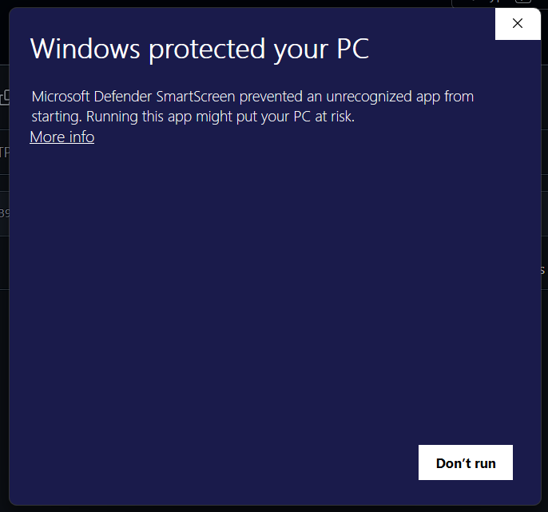
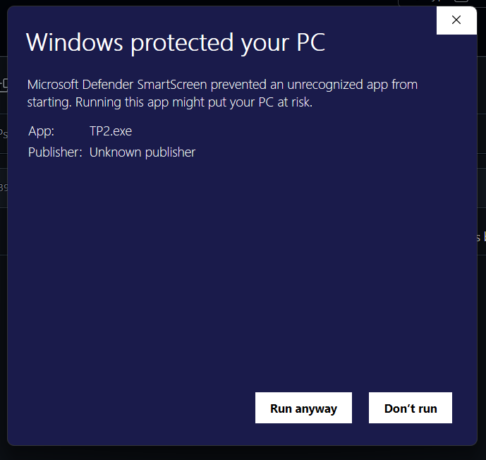

# Ejercicios de Programación - Go y Python

[](https://github.com/SoyGabrielRojas/UCP)

Este repositorio reúne mis soluciones a las guías de la materia **Programación Estructurada**.  
La mayoría de los ejercicios están hechos en **Go**, aunque en un caso puntual usé **Python** porque me resultó más cómodo para mostrar matrices.

## Estructura del repositorio

- **Guia1/**: Ejercicios en pseudocódigo (.psc) y el PDF de las preguntas.
- **Guia2/**, **Guia3/**, **Guia4/**, **Guia5/**, **Guia6/**: Ejercicios resueltos en Go, cada guía en su propia carpeta.
- **Guia5/ejercicio5.py**: Ejercicio de matrices en Python para mostrar cómo se visualiza de forma más clara respecto a Go.
- **TP2/**: Trabajo práctico especial con varios ejercicios integrados en un menú interactivo.

## ¿Por qué Go?

Go me parece un lenguaje bastante robusto y eficiente.  
Sé que suele usarse más para backend, pero igual me gusta mucho y me pareció una buena oportunidad para practicarlo.

## ¿Por qué Python para matrices?

Porque Python es mucho más visual para trabajar con matrices.  
Su sintaxis y librerías hacen que se vea todo más claro que en Go.  
Por eso, en la **Guía 5** incluí un ejercicio en Python.

---

## TP2 en Go

El archivo principal es **`TP2.go`**, que contiene un menú interactivo con varios ejercicios:

1. **Matriz 5x10**  
   - Permite ingresar valores en una matriz de 5 filas y 10 columnas.  
   - Muestra el máximo y mínimo con sus posiciones.

2. **Matriz traspuesta**  
   - Calcula y muestra la matriz traspuesta de la anterior (solo disponible si se ejecutó el ejercicio 1 antes).

3. **Matriz cuadrada (orden n)**  
   - Permite ingresar una matriz cuadrada de tamaño `n x n`.  
   - Muestra:
     - Diagonal principal  
     - Diagonal secundaria  
     - Triangular superior  
     - Triangular inferior

4. **Informe de empleados La Huelga S.A.**  
   - Solicita datos de 3 empleados: código, horas normales y horas extras.  
   - Calcula su pago total (normales a $2350 y extras a $3500).  
   - Muestra un informe tabulado con cada valor.

0. **Salir** del programa.

---

## TP2 en Python

Además del archivo en Go, incluí **`TP2.py`** con los mismos ejercicios del TP2, pero en Python.  
Esto es útil si tienes problemas para ejecutar el `.exe` en Windows, o si prefieres no instalar Go localmente.

Para ejecutarlo:

1. Instala Python desde [https://www.python.org/downloads/](https://www.python.org/downloads/).
2. Abre una terminal en la carpeta `TP2`.
3. Ejecuta el archivo con:

   ```bash
   python TP2.py
   ```

El menú y los ejercicios funcionan igual que en Go, pero usando la consola de Python.

---

## Cómo ejecutar los ejercicios

### Opción 1: Ejecutar el código fuente (Go instalado)

1. Instalar Go desde [https://go.dev/dl/](https://go.dev/dl/).  
2. Abrir una terminal en la carpeta correspondiente (por ejemplo `TP2`).  
3. Ejecutar con:  

   ```bash
   go run TP2.go
   ```

### Opción 2: Usar el ejecutable compilado (Windows)

Si usas el archivo `TP2.exe` compilado, Windows puede mostrar esta advertencia de seguridad:



**Para ejecutarlo correctamente:**
1. Haz clic en **"More info"**
2. Luego aparecerá el botón **"Run anyway"**
3. Haz clic en **"Run anyway"** para ejecutar el programa

> ⚠️ Esto sucede porque el ejecutable no tiene firma digital, pero es seguro, ya que es una compilacion echa en go:

```bash
go build -o TP2.exe TP2.go
```

---

## Nota sobre seguridad en Windows

Los ejecutables compilados localmente pueden activar **Microsoft Defender SmartScreen**. Esto es normal y no indica que el código sea malicioso. Simplemente significa que el archivo no está firmado digitalmente por una entidad reconocida.

**Opciones seguras:**
- Ejecutar con `go run` (no genera .exe)
- Compilar y ejecutar desde terminal
- Hacer clic en **"More info"** → **"Run anyway"** si usas el .exe 



---

## Requisitos

- **Go** 1.18 o superior (para ejecutar el código fuente)
- **Python** 3.6+ (solo para el ejercicio de matrices en Guia5/)